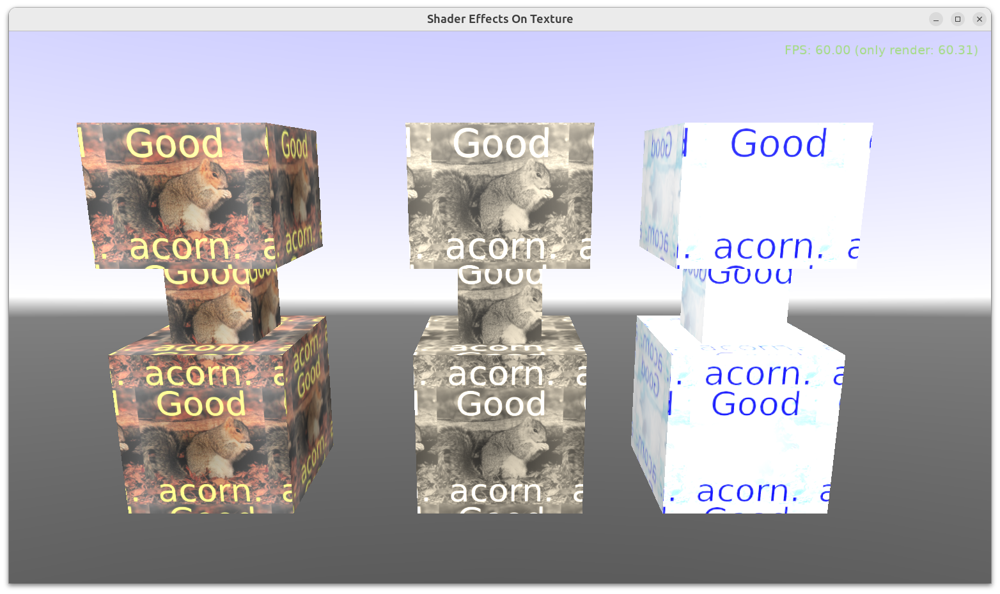

# Shader Effects On Texture

Example demonstrating how to apply shader effects on a texture.

_Shader effects_ are a technique in _Castle Game Engine_ to add a shader code (using GLSL, _OpenGL Shading Language_) to something, to modify its appearance. The shader code defines a special function `PLUG_xxx` which is then called from the engine to apply the effect.

For more information about shader effects see:

- https://castle-engine.io/compositing_shaders.php
- https://castle-engine.io/compositing_shaders_doc/html/
- and the important example [examples/viewport_and_scenes/shader_effects](https://github.com/castle-engine/castle-engine/tree/master/examples/viewport_and_scenes/shader_effects).

This particular example focuses on a special kind of "shader effect" that you can add to a texture node in _Castle Game Engine_. Such effect changes the effective texture RGBA (color, opacity) read by the engine. You can use it to apply various effects to the texture, like color correction, grayscale, sepia, manipulate effective alpha (used for blending) etc.

Using [Castle Game Engine](https://castle-engine.io/).

## Building

Compile by:

- [CGE editor](https://castle-engine.io/editor). Just use menu items _"Compile"_ or _"Compile And Run"_.

- Or use [CGE command-line build tool](https://castle-engine.io/build_tool). Run `castle-engine compile` in this directory.

- Or use [Lazarus](https://www.lazarus-ide.org/). Open in Lazarus `shader_effects_on_texture_standalone.lpi` file and compile / run from Lazarus. Make sure to first register [CGE Lazarus packages](https://castle-engine.io/lazarus).

- Or use [Delphi](https://www.embarcadero.com/products/Delphi). Open in Delphi `shader_effects_on_texture_standalone.dproj` file and compile / run from Delphi. See [CGE and Delphi](https://castle-engine.io/delphi) documentation for details.